<div align="center">

<!-- PROJECT BANNER -->


<br/>

[](https://unity.com/)
[](https://docs.microsoft.com/en-us/dotnet/csharp/)
[](https://www.microsoft.com/windows)
[](.)
[](.)
[](LICENSE)
[](.)

<br/>

> **🌱 Plant crops by solving Arithmetic. Water them with Fractions. Harvest with Profit & Loss.**
>
> *A 2D educational farming game where every farming action requires solving a mathematics question.*

<br/>

[🎮 Play Now](#-installation-guide) · [📖 How To Play](#-how-to-run) · [🏗️ Architecture](#-architecture) · [🗺️ Roadmap](#-future-improvements)

<br/>

---

</div>

## 📋 Table of Contents

<details>
<summary>Click to expand</summary>

- [🌾 Project Overview](#-project-overview)
- [🎬 Gameplay Loop](#-gameplay-loop)
- [✨ Features](#-features)
- [📐 Educational Concepts](#-educational-concepts)
- [📸 Screenshots](#-screenshots)
- [🎥 Gameplay Video](#-gameplay-video)
- [🏗️ Architecture](#-architecture)
- [📜 Script Architecture](#-script-architecture)
- [❓ Question System](#-question-system)
- [💾 Save System](#-save-system)
- [📈 Progression System](#-progression-system)
- [📁 Folder Structure](#-folder-structure)
- [📦 Installation Guide](#-installation-guide)
- [▶️ How To Run](#️-how-to-run)
- [🗺️ Future Improvements](#️-future-improvements)
- [👨‍💻 Developer](#-developer)
- [📄 License](#-license)

</details>

<br/>

---

## 🌾 Project Overview

<table>
<tr>
<td width="60%">

**Math Farmer** is a 2D educational farming game built in Unity where players must solve mathematics questions to perform every farming action.

Rather than clicking to instantly plant, water, or harvest, each action is gated behind an educational question. Correct answers progress the farm; wrong answers require the player to try again. As the player earns XP and levels up, questions become progressively harder — keeping the challenge matched to the player's growing ability.

The game covers **Arithmetic**, **Fractions**, and **Profit & Loss** — presented in a fun, interactive farming context that makes learning feel rewarding rather than repetitive.

### 🎯 Design Goals

- **Learning through doing** — maths is the mechanic, not an obstacle
- **Immediate feedback** — right or wrong, the player knows instantly
- **Progressive difficulty** — harder questions unlock at higher levels
- **Persistent progress** — coins, XP, level, and crop states are all saved

</td>
<td width="40%">

| Property | Value |
|---|---|
| 🎮 **Engine** | Unity 2022 |
| 💻 **Language** | C# |
| 🪟 **Platform** | Windows PC |
| 🎭 **Genre** | 2D Educational |
| 📦 **Type** | Portfolio Project |
| ✅ **Status** | Completed |
| 🌱 **Soil Plots** | 6 |
| 🧮 **Question Types** | 3 Categories |
| 💾 **Save System** | Unity PlayerPrefs |
| 📊 **Stats Tracked** | 4 Metrics |

</td>
</tr>
</table>

<br/>

---

## 🎬 Gameplay Loop

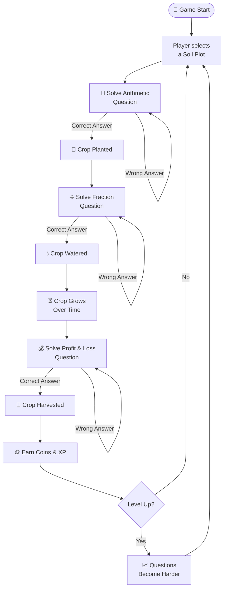

<br/>

---

## ✨ Features

<details>
<summary>🌱 <b>Farming System</b></summary>

<br/>

| Feature | Description |
|---|---|
| 🟫 **6 Soil Plots** | Six interactive, individually selectable plots |
| 🌱 **Plant Action** | Unlocked by solving an Arithmetic question |
| 💧 **Water Action** | Unlocked by solving a Fraction question |
| 🌾 **Harvest Action** | Unlocked by solving a Profit & Loss question |
| ⏳ **Crop Growth** | Crops grow over real time after watering |
| 📊 **Growth Bar** | Visual progress bar per plot showing growth state |

</details>

<details>
<summary>🧮 <b>Educational System</b></summary>

<br/>

| Category | Question Types |
|---|---|
| ➕ **Arithmetic** | Addition, Subtraction, Multiplication, Division |
| ➗ **Fractions** | Fraction to Decimal conversion, Fraction Addition |
| 💰 **Profit & Loss** | Profit Calculation, Profit Percentage |

</details>

<details>
<summary>📈 <b>Progression System</b></summary>

<br/>

| Element | Behaviour |
|---|---|
| 🪙 **Coins** | Earned on each successful harvest |
| ⭐ **XP** | Gained on correct answers and harvests |
| 🏆 **Levels** | Player levels up as XP accumulates |
| 📐 **Difficulty Scaling** | Question complexity increases with level |

</details>

<details>
<summary>📊 <b>Statistics System</b></summary>

<br/>

| Metric | Description |
|---|---|
| 📝 **Questions Answered** | Total questions presented |
| ✅ **Correct Answers** | Total correct responses |
| ❌ **Wrong Answers** | Total incorrect responses |
| 🎯 **Accuracy %** | Correct ÷ Total × 100 |

</details>

<details>
<summary>💾 <b>Save System</b></summary>

<br/>

| Saved Data | Type |
|---|---|
| 🪙 Coins | Int |
| ⭐ XP | Int |
| 🏆 Level | Int |
| 🌱 Crop States | Per-plot enum |
| ⏳ Crop Progress | Per-plot float |
| 📊 Statistics | Int metrics |

Supports **Save**, **Load**, and **New Game** via Unity PlayerPrefs.

</details>

<br/>

---

## 📐 Educational Concepts

<div align="center">

| Concept | Farming Action | Example |
|---|:---:|---|
| ➕ **Addition** | 🌱 Planting | `47 + 38 = ?` |
| ➖ **Subtraction** | 🌱 Planting | `93 - 56 = ?` |
| ✖️ **Multiplication** | 🌱 Planting | `7 × 8 = ?` |
| ➗ **Division** | 🌱 Planting | `84 ÷ 4 = ?` |
| 🔢 **Fraction → Decimal** | 💧 Watering | `3/4 = ?` |
| ➕ **Fraction Addition** | 💧 Watering | `1/3 + 1/4 = ?` |
| 💰 **Profit Calculation** | 🌾 Harvesting | `SP=120, CP=90 → Profit=?` |
| 📊 **Profit Percentage** | 🌾 Harvesting | `CP=80, Profit=20 → %=?` |

</div>

> 💡 **Difficulty Scales with Level** — At higher levels, operand values increase, fractions become more complex, and profit/loss scenarios involve larger numbers.

<br/>

---

## 📸 Screenshots

### 🏠 Main Menu

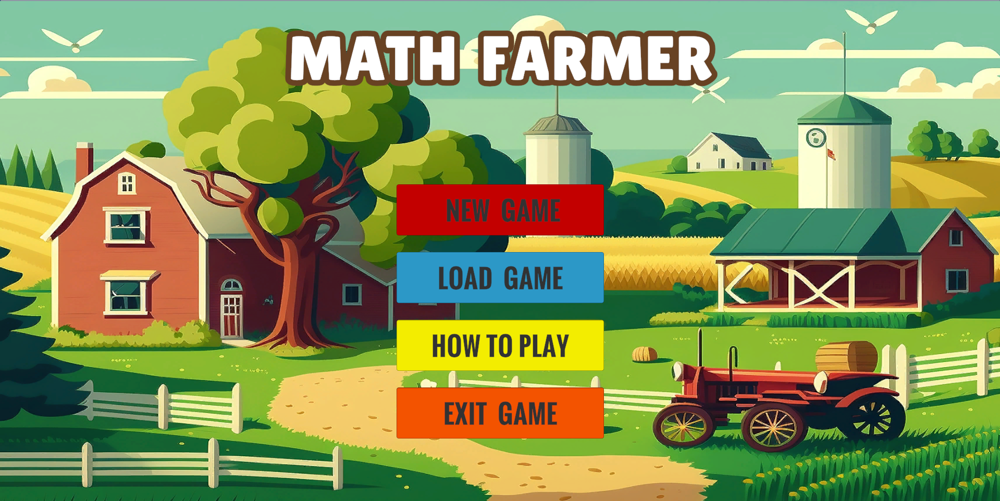

### ❓ How To Play

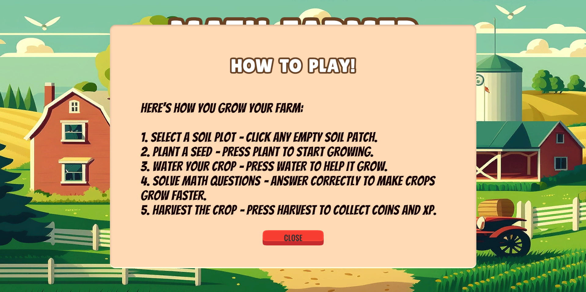

### 🟫 Empty Farm

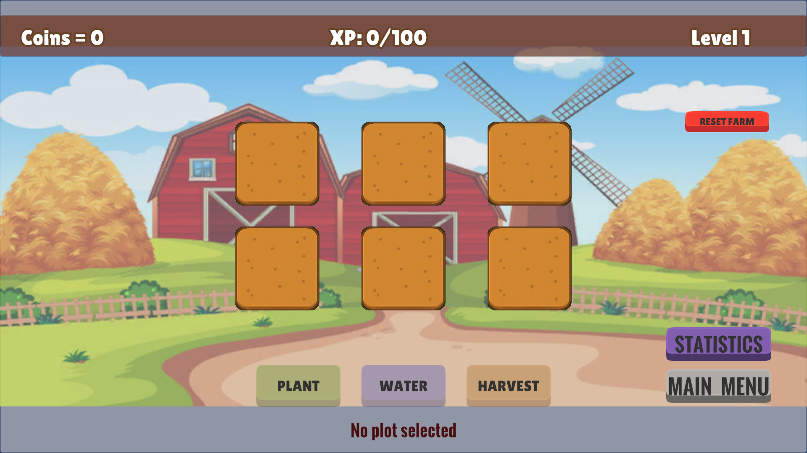

### 🌾 Gameplay

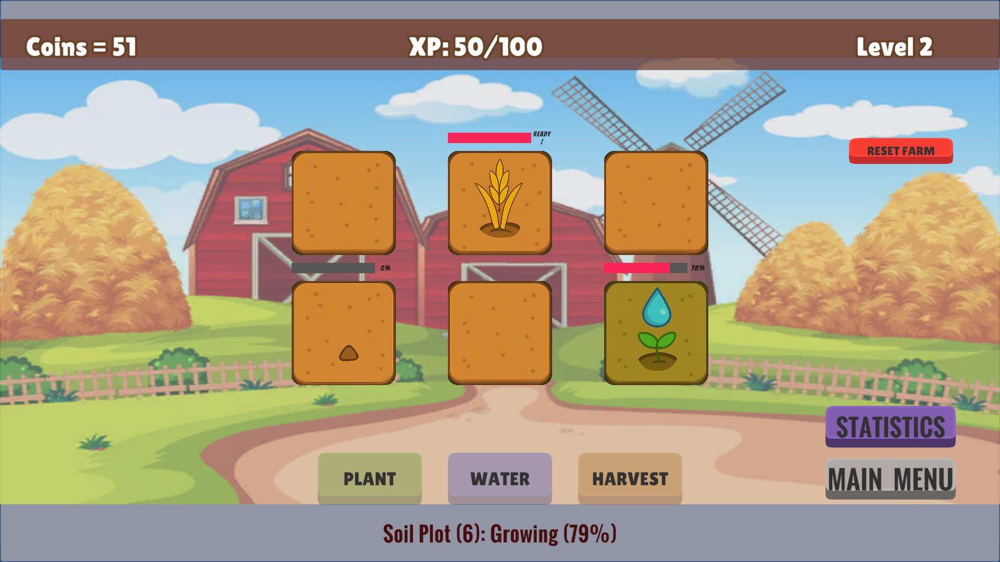

### 🧮 Question System

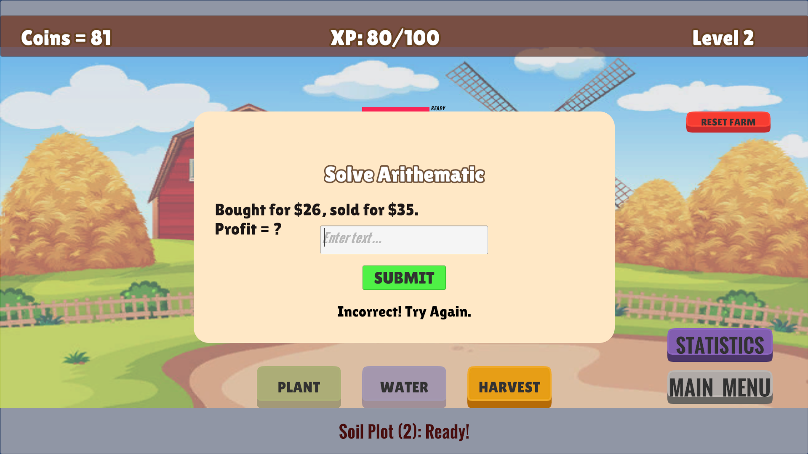

### 📊 Statistics Panel

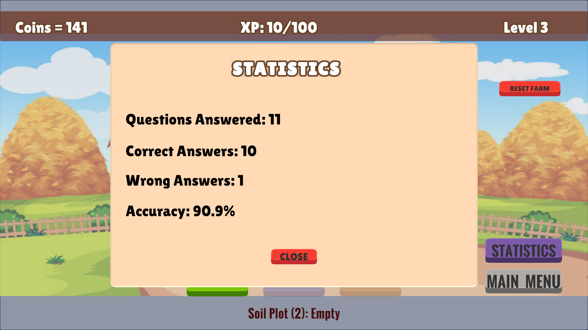

<br/>

---

## 🎥 Gameplay Video

<div align="center">

<a href="https://drive.google.com/file/d/1A3fYxLSkIqhGBuzcK7Vin21qZoXuWnDZ/view">


</a>

### ▶️ Watch Full Gameplay

Click the thumbnail above to view the gameplay video.

</div>

<br/>

---

## 🏗️ Architecture

### 🗺️ Overall Game Architecture

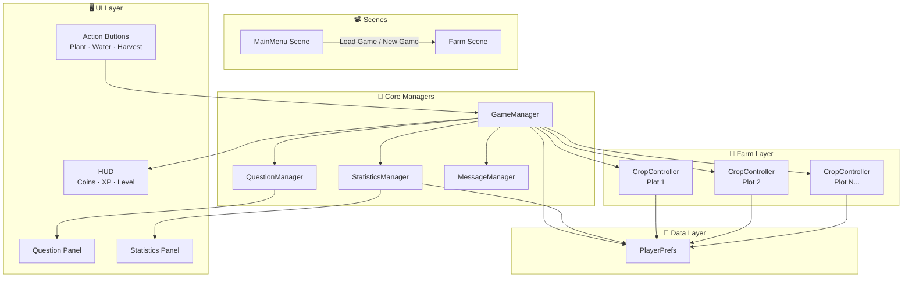

### 🎮 Game State Flow

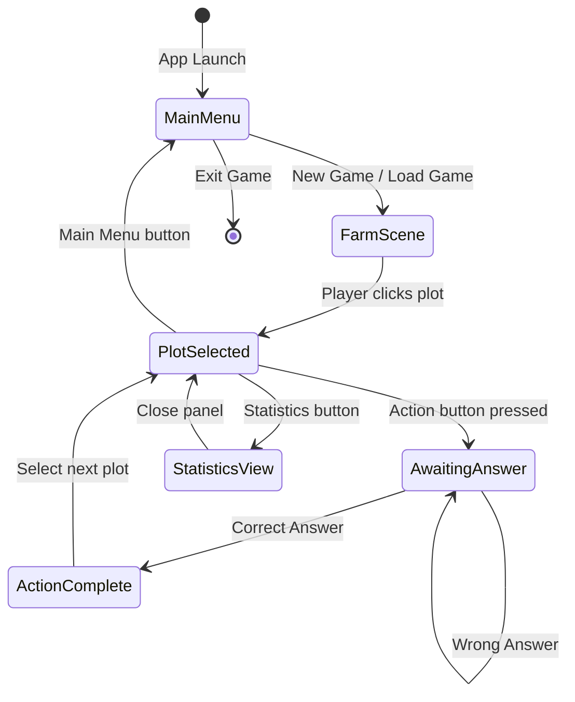

<br/>

---

## 📜 Script Architecture

### 📊 Script Dependency Map

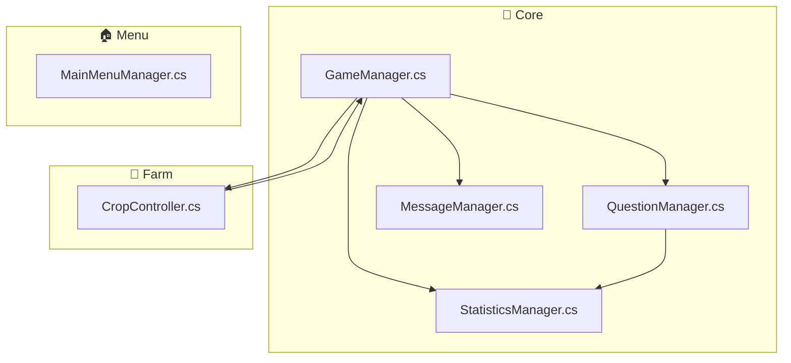

### 📋 Script Reference Table

| Script | Category | Responsibility |
|---|:---:|---|
| `GameManager.cs` | 🔧 Core | Player progression, coins, XP, levels, save/load, farm reset, plot selection, gameplay actions |
| `QuestionManager.cs` | 🔧 Core | Question generation, difficulty scaling, answer validation, question UI |
| `StatisticsManager.cs` | 🔧 Core | Statistics tracking, accuracy calculation, statistics UI, save/load stats |
| `MessageManager.cs` | 🔧 Core | Temporary on-screen notifications, auto-clear messages |
| `CropController.cs` | 🌱 Farm | Crop state machine, growth system, growth bar, per-plot save data, selection logic |
| `MainMenuManager.cs` | 🏠 Menu | Main menu navigation, New Game, Load Game, Exit, How To Play panel |

<details>
<summary><b>🔧 GameManager.cs — Detail</b></summary>

<br/>

| Responsibility | Description |
|---|---|
| 🪙 **Coins** | Award and track player coins |
| ⭐ **XP** | Award XP on correct answers and harvests |
| 🏆 **Level** | Increment level on XP threshold; notify QuestionManager |
| 💾 **Save / Load** | Write and read all persistent game state via PlayerPrefs |
| 🔄 **Farm Reset** | Clear all plots back to Empty state |
| 🖱️ **Plot Selection** | Track which plot is currently selected |
| 🎮 **Gameplay Actions** | Coordinate Plant / Water / Harvest flow with QuestionManager |

</details>

<details>
<summary><b>🌱 CropController.cs — Crop States</b></summary>

<br/>

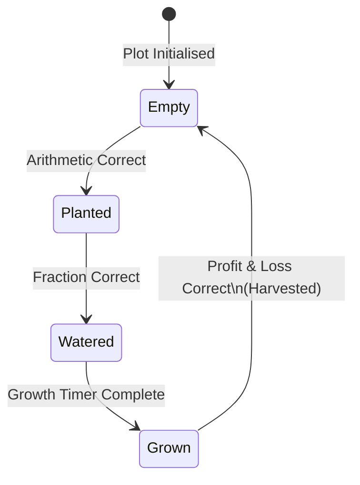

| State | Visual | Next Action |
|---|:---:|---|
| `Empty` | Bare soil | Plant (Arithmetic question) |
| `Planted` | Seed in soil | Water (Fraction question) |
| `Watered` | Seedling | Wait for growth timer |
| `Grown` | Full crop | Harvest (Profit & Loss question) |

</details>

<details>
<summary><b>❓ QuestionManager.cs — Detail</b></summary>

<br/>

| Responsibility | Description |
|---|---|
| 🎲 **Generation** | Randomly generate questions within level-scaled ranges |
| 📐 **Difficulty Scaling** | Increase operand complexity as player level increases |
| ✅ **Validation** | Compare player input against computed correct answer |
| 🖥️ **UI** | Show/hide question panel, display question text, handle input field |

</details>

<br/>

---

## ❓ Question System

### Question Generation Flow

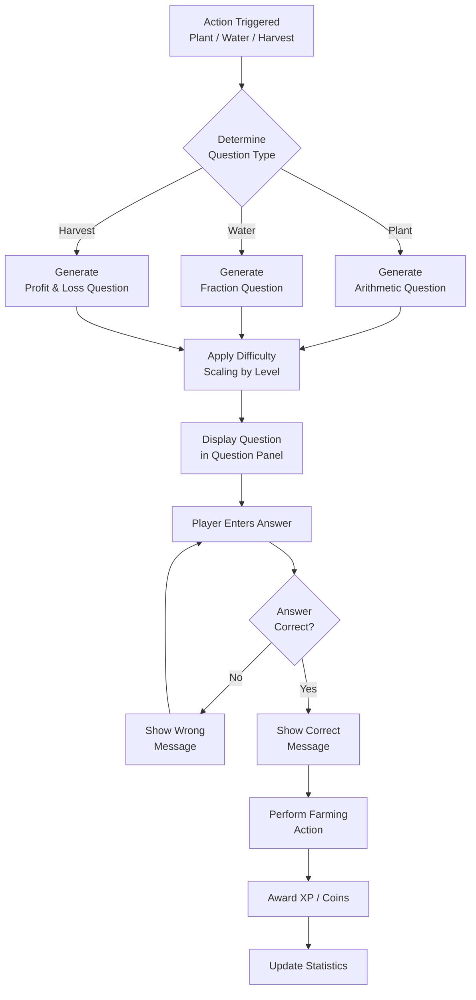

### 🧮 Question Categories

<details>
<summary><b>➕ Arithmetic Questions (Planting)</b></summary>

<br/>

| Operation | Level 1 Example | Level 5 Example |
|---|---|---|
| Addition | `12 + 7 = ?` | `347 + 589 = ?` |
| Subtraction | `15 - 8 = ?` | `600 - 247 = ?` |
| Multiplication | `3 × 4 = ?` | `17 × 23 = ?` |
| Division | `12 ÷ 3 = ?` | `252 ÷ 12 = ?` |

</details>

<details>
<summary><b>➗ Fraction Questions (Watering)</b></summary>

<br/>

| Type | Level 1 Example | Level 5 Example |
|---|---|---|
| Fraction → Decimal | `1/2 = ?` | `7/8 = ?` |
| Fraction Addition | `1/2 + 1/4 = ?` | `3/7 + 2/5 = ?` |

</details>

<details>
<summary><b>💰 Profit & Loss Questions (Harvesting)</b></summary>

<br/>

| Type | Level 1 Example | Level 5 Example |
|---|---|---|
| Profit Calculation | `CP=10, SP=15 → Profit=?` | `CP=340, SP=480 → Profit=?` |
| Profit Percentage | `CP=50, Profit=10 → %=?` | `CP=240, Profit=60 → %=?` |

</details>

<br/>

---

## 💾 Save System

### Save / Load Flow

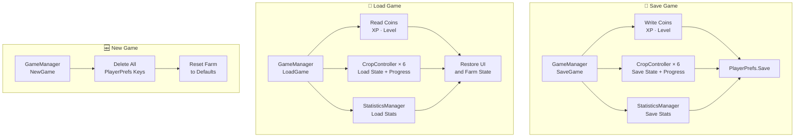

### 💾 PlayerPrefs Key Registry

| Key | Type | Manager | Description |
|---|:---:|---|---|
| `Coins` | Int | GameManager | Player's current coin balance |
| `XP` | Int | GameManager | Player's accumulated XP |
| `Level` | Int | GameManager | Player's current level |
| `CropState_N` | Int | CropController | Crop state enum for plot N (0–5) |
| `CropProgress_N` | Float | CropController | Growth progress for plot N (0–5) |
| `QuestionsAnswered` | Int | StatisticsManager | Total questions presented |
| `CorrectAnswers` | Int | StatisticsManager | Total correct responses |
| `WrongAnswers` | Int | StatisticsManager | Total wrong responses |

> **Note:** `PlayerPrefs` persists to the Windows Registry. New Game calls `PlayerPrefs.DeleteAll()` to ensure a clean slate.

<br/>

---

## 📈 Progression System

### Player Progression Flow

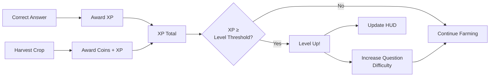

### 📊 Progression Summary

| Element | Gained By | Effect |
|---|---|---|
| 🪙 **Coins** | Harvesting a grown crop | Currency (future shop use) |
| ⭐ **XP** | Correct answers + harvests | Fills level progress bar |
| 🏆 **Level** | XP threshold reached | Unlocks harder questions |
| 📐 **Difficulty** | Level increase | Larger operands, complex fractions |

<br/>

---

## 📁 Folder Structure

```
📦 Math Farmer
 ┣ 📂 Assets
 ┣ 📂 Packages
 ┣ 📂 ProjectSettings
 ┣ 📂 Screenshots
 ┃ ┣ 🖼️ MainMenu.png
 ┃ ┣ 🖼️ HowToPlay.png
 ┃ ┣ 🖼️ EmptyFarm.png
 ┃ ┣ 🖼️ GameFarm.png
 ┃ ┣ 🖼️ Question.png
 ┃ └ 🖼️ Statistics.png
 ┣ 📂 Gameplay
 ┃ └ 🎬 MathFarmer(GamePlay).mp4
 ┣ 📄 README.md
 ┣ 📄 LICENSE
 └ 📄 .gitignore
```

<br/>

---

## 📦 Installation Guide

### Option A — Pre-Built Release *(Recommended)*

1. Go to the [**Releases**](../../releases) tab
2. Download `MathFarmer_v1.0_Windows.zip`
3. Extract the archive to any folder
4. Run `MathFarmer.exe`
5. No installation required — play immediately 🎮

### Option B — Build from Source

```bash
# 1. Clone the repository
git clone https://github.com/Suryansh1483/Math-Farmer.git

# 2. Open Unity Hub
# → Click "Add project from disk"
# → Select the cloned Math Farmer folder

# 3. Open in Unity 2022.x

# 4. In Unity Editor:
# → File → Build Settings
# → Platform: PC, Mac & Linux Standalone
# → Target Platform: Windows
# → Architecture: x86_64
# → Add Open Scenes (MainMenu + Farm Scene)
# → Click Build → choose output folder

# 5. Run MathFarmer.exe
```

> **System Requirements**
>
> | Component | Minimum |
> |---|---|
> | OS | Windows 10 (64-bit) |
> | CPU | Intel Core i3 / AMD Ryzen 3 |
> | RAM | 4 GB |
> | GPU | Integrated (DirectX 11) |
> | Storage | 150 MB free |

<br/>

---

## ▶️ How To Run

```
1. Launch MathFarmer.exe
2. Choose New Game or Load Game from the Main Menu
3. Click any soil plot on the farm
4. Click the Plant button → Solve the Arithmetic question
5. Click the Water button → Solve the Fraction question
6. Wait for the crop to grow (watch the growth bar)
7. Click the Harvest button → Solve the Profit & Loss question
8. Collect your Coins and XP
9. Level up and face harder questions!
10. View your accuracy in the Statistics panel at any time
```

> 💡 **Tip:** Wrong answers don't lose you progress — you just have to answer correctly before the action completes. Use wrong answers as learning opportunities.

### 🏠 Main Menu Options

| Option | Description |
|---|---|
| ▶️ **New Game** | Start fresh — all saved data is cleared |
| 📂 **Load Game** | Continue from your last saved state |
| ❓ **How To Play** | View in-game instructions panel |
| 🚪 **Exit Game** | Quit the application |

<br/>

---

## 🗺️ Future Improvements

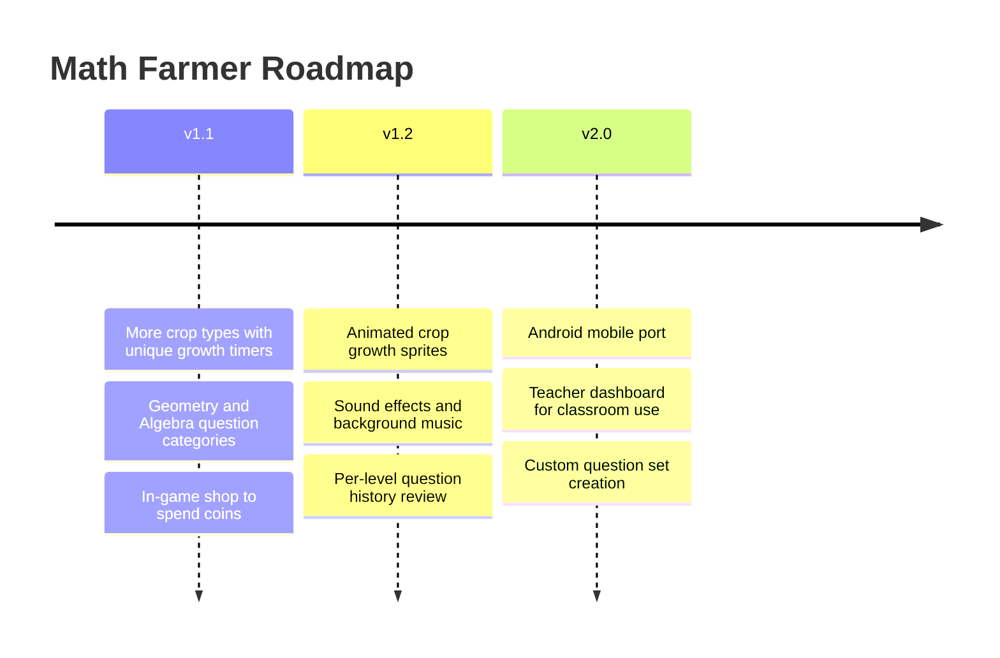

| Version | Feature | Priority |
|---|---|:---:|
| v1.1 | 🌽 More crop varieties | 🔴 High |
| v1.1 | 📐 Geometry questions | 🔴 High |
| v1.1 | 🛒 In-game shop | 🟡 Medium |
| v1.2 | 🎨 Animated sprites | 🟡 Medium |
| v1.2 | 🔊 Audio system | 🟡 Medium |
| v2.0 | 📱 Android support | 🟢 Low |
| v2.0 | 🏫 Teacher dashboard | 🟢 Low |
| v2.0 | 📝 Custom question sets | 🟢 Low |

<br/>

---

## 📚 Learning Outcomes

| Skill Area | Competency Demonstrated |
|---|---|
| 🎮 **Unity 2D** | Scene management, 2D GameObject hierarchy, Prefabs, UI Canvas |
| 💻 **C# & OOP** | State machines, Singleton pattern, event-driven logic |
| 🏗️ **Game Architecture** | Manager pattern, decoupled systems, separation of concerns |
| 🧮 **Educational Design** | Difficulty scaling, immediate feedback loops, curriculum mapping |
| 💾 **Data Persistence** | PlayerPrefs-based save/load/new-game system |
| 📊 **Statistics Systems** | Real-time tracking, accuracy calculation, persistent stats |
| 🖥️ **UI/UX** | Multi-panel navigation, HUD design, dynamic question UI |
| 📝 **Documentation** | Technical writing, Mermaid diagrams, README architecture |

<br/>

---

## 👨‍💻 Developer

<div align="center">

<table>
<tr>
<td align="center" width="100%">

<br/>

### Suryansh Patel

*Unity Game Developer &nbsp;·&nbsp; C# &nbsp;·&nbsp; Portfolio Project*

<br/>

[](https://github.com/Suryansh1483)
[](https://www.linkedin.com/in/suryansh-patel-7b32b2324/)

<br/>

</td>
</tr>
</table>

> *"Math Farmer was built to explore how educational content can be woven directly into game mechanics — making learning feel like playing, not studying."*
>
> — **Suryansh Patel**

</div>

<br/>

---

## 📄 License

```
MIT License

Copyright (c) 2024 Suryansh Patel

Permission is hereby granted, free of charge, to any person obtaining a copy
of this software and associated documentation files (the "Software"), to deal
in the Software without restriction, including without limitation the rights
to use, copy, modify, merge, publish, distribute, sublicense, and/or sell
copies of the Software, and to permit persons to whom the Software is
furnished to do so, subject to the following conditions:

The above copyright notice and this permission notice shall be included in all
copies or substantial portions of the Software.

THE SOFTWARE IS PROVIDED "AS IS", WITHOUT WARRANTY OF ANY KIND, EXPRESS OR
IMPLIED, INCLUDING BUT NOT LIMITED TO THE WARRANTIES OF MERCHANTABILITY,
FITNESS FOR A PARTICULAR PURPOSE AND NONINFRINGEMENT.
```

<br/>

---

## 🙏 Acknowledgements

| Resource | Credit |
|---|---|
| 🎮 [Unity Technologies](https://unity.com) | Game engine and documentation |
| 📝 [TextMesh Pro](https://docs.unity3d.com/Packages/com.unity.textmeshpro@3.0/manual/index.html) | Advanced UI text rendering |
| 📷 [Unity Asset Store](https://assetstore.unity.com) | 2D sprites and farm assets |
| 📖 [Unity Learn](https://learn.unity.com) | Tutorials and best practices |
| 🌐 [GitHub Community](https://github.com) | Open source inspiration |

<br/>

---

<div align="center">


**⭐ If this project helped you or impressed you, please star the repository!**

*Built with ❤️ by [Suryansh Patel](https://github.com/Suryansh1483)*

[](https://unity.com)
[](https://docs.microsoft.com/dotnet/csharp/)

</div>
